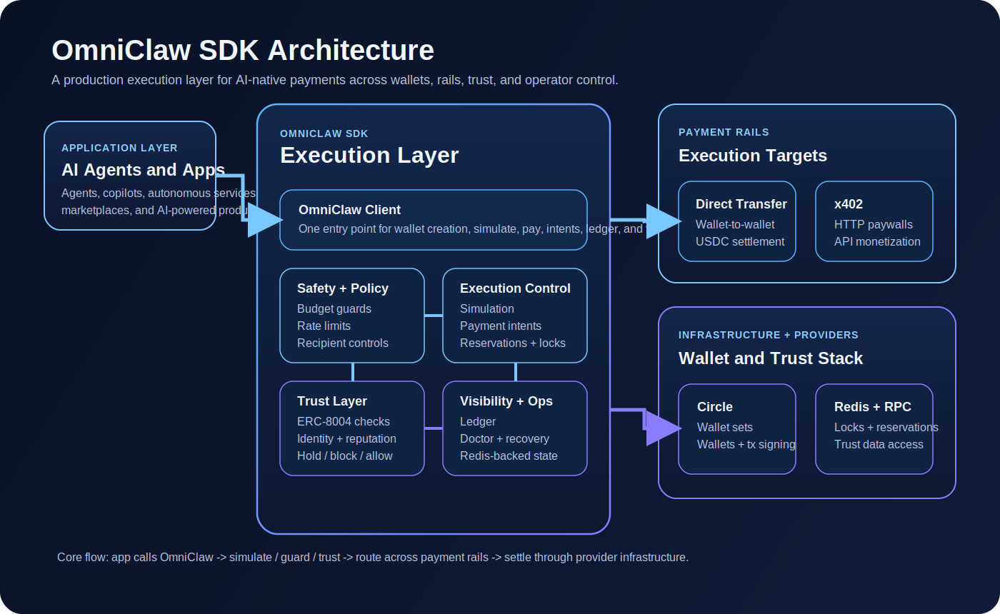

# OmniClaw

**OmniClaw is the economic control and trust infrastructure for autonomous agents — enabling them to pay, get paid, and transact securely under real-time policy enforcement.**

OmniClaw is the full payment layer for AI agents — not just paying, but earning too. It sits between raw wallet infrastructure and production payment flows so AI agents and AI-powered apps can move money with better safety, trust, and operator control.

Instead of wiring wallets, payment routing, guardrails, intents, trust checks, and recovery flows by hand, OmniClaw gives you one SDK for:

**For Agents That Pay:**
- wallet creation and management
- guarded `pay()` execution
- `simulate()` before funds move
- x402 and direct transfer routing
- cross-chain USDC flows
- payment intents with reservation handling
- nanopayments — gas-free EIP-3009 USDC transfers via Circle Gateway

**For Agents That Earn:**
- Seller SDK — accept payments with automatic 402 responses
- `sell()` decorator — protect endpoints and get paid automatically
- Facilitator integration — Circle Gateway, Coinbase CDP, OrderN, RBX, Thirdweb

**For Both:**
- Trust Gate — ERC-8004 identity and reputation verification
- Atomic Spending Guards — budget limits, rate limits, recipient whitelists
- Multi-facilitator support — choose your preferred payment infrastructure

- Product: `OmniClaw`
- Company: `Omnuron AI`
- Official site: `omniclaw.ai`
- SDK status: `1220` passing SDK tests in `tests/`
- Python: `>=3.10`
- Package: `omniclaw`



*OmniClaw sits between AI applications and wallet/payment infrastructure, adding simulation, routing, guardrails, intents, trust checks, settlement controls, and webhook security.*

## Why OmniClaw

- Ship AI payment flows without building your own execution layer from scratch
- Use one SDK across wallets, simulation, execution, guardrails, and trust-aware payments
- Give operators controls before an AI system can spend
- Evaluate identity and trust signals, not just bare wallet addresses

## Who It Is For

- AI agents that need to pay for tools, services, APIs, or other agents
- AI agents that need to accept payments and earn money
- AI-powered applications that need embedded payment execution
- Teams building web2 or web3 products where AI systems need to move money
- Builders who want wallet infrastructure plus policy, simulation, trust, and operator controls

## Get Running Fast

```bash
pip install omniclaw
omniclaw doctor
```

```python
import asyncio

from omniclaw import Network, OmniClaw

async def main():
    client = OmniClaw(network=Network.ARC_TESTNET)

    wallet_set, wallet = await client.create_agent_wallet("research-agent")

    simulation = await client.simulate(
        wallet_id=wallet.id,
        recipient="0x742d35Cc6634C0532925a3b844Bc9e7595f5e4a0",
        amount="2.50",
    )

    if simulation.would_succeed:
        await client.pay(
            wallet_id=wallet.id,
            recipient="0x742d35Cc6634C0532925a3b844Bc9e7595f5e4a0",
            amount="2.50",
            purpose="agent purchase",
        )

asyncio.run(main())
```

### Seller Quick Start

```python
from fastapi import FastAPI
from omniclaw import OmniClaw, Network

app = FastAPI()
client = OmniClaw(network=Network.BASE_SEPOLIA)

@app.get("/premium-data")
async def get_data(payment=Depends(client.sell("$0.01"))):
    info = client.current_payment()
    return {"data": "premium content", "paid_by": info.payer}
```

Core workflow: verify setup, create a wallet, simulate the payment, then execute safely.

## What It Does

- Create and manage Circle wallet sets and wallets
- Execute `pay()` with automatic routing for addresses, URLs, and cross-chain transfers
- Enforce guardrails with budget, rate-limit, recipient, single-tx, and confirm guards
- Support authorize/confirm flows with payment intents
- Simulate payments before execution
- Record transaction history in the built-in ledger
- Optionally run ERC-8004 trust verification when an RPC URL is configured
- **Receive nanopayments** as a seller via `@client.sell()` FastAPI decorator (EIP-3009 gas-free)
- **Send nanopayments** as a buyer — micro-amounts automatically use Circle Gateway nanopayments
- Verify webhook signatures and persist webhook deduplication (`notificationId`) for idempotent processing

## Built For Production

- Raw wallet APIs are not enough. AI systems need policy, simulation, reservations, idempotency, and failure handling before they are allowed to spend.
- x402 is powerful, but it is only one rail. Most production products need one SDK that can handle wallet transfers, x402 endpoints, and cross-chain USDC movement together.
- Payment safety cannot live in ad hoc app code. OmniClaw ships budget guards, rate limits, recipient controls, single-tx limits, confirm thresholds, payment intents, and ledger tracking as first-class primitives.
- Trust matters when one AI system pays another. OmniClaw surfaces ERC-8004-style trust evaluation so developers can make decisions with more context than a bare address.
- Developer adoption matters. The entry point stays simple: initialize `OmniClaw`, create a wallet, run `simulate()`, then call `pay()`.

## Where OmniClaw Fits

- Use Circle for wallet custody and transaction infrastructure.
- Use x402 where pay-per-request HTTP payments make sense.
- Use nanopayments for gas-free micro-transactions (EIP-3009 on Circle Gateway).
- Use OmniClaw to orchestrate execution safely across those systems.

That means fewer one-off payment scripts, less duplicated safety code, and a faster path from demo agent to production.

OmniClaw is not trying to replace the wallet or settlement providers already entering this market. It is the layer that makes them usable for AI-native execution.

## Proof Points

- `pay()` routes across direct transfers, x402-style URLs, and cross-chain USDC flows.
- `simulate()` lets agents and operators know whether a payment would succeed before funds move.
- Payment intents provide authorize/confirm/cancel flows with reservation handling.
- Built-in guards give operators programmable spending controls.
- `omniclaw doctor` gives developers and operators one command to verify credential, recovery, and setup state.
- ERC-8004 support makes trust and identity part of the product story, not an afterthought.

## Trust-Aware Payments

Most payment SDKs stop at settlement. OmniClaw makes it possible to decide whether to auto-pay, hold, or block a payment with more context than a bare wallet address.

For teams building AI-to-AI commerce, autonomous services, or machine-driven payments, that means better answers to questions like:

- who is this agent?
- what trust signals exist for it?
- should this payment proceed automatically?
- when should a payment be held, confirmed, or blocked?

OmniClaw integrates ERC-8004-style trust evaluation into the SDK so developers can add trust-aware payment logic without building a separate reputation and validation layer first.

## Install

```bash
pip install omniclaw
```

For local development in this repo:

```bash
uv sync --extra dev
```

To build release artifacts with one command:

```bash
./build.sh
```

## Quick Setup

**1. Create a `.env` file:**

```env
CIRCLE_API_KEY=your_circle_api_key
ENTITY_SECRET=your_entity_secret
```

**2. Configure in code:**

```python
from omniclaw import OmniClaw, Network

client = OmniClaw(network=Network.BASE_SEPOLIA)
```

**3. Check setup:**

```bash
omniclaw doctor   # Verify credentials
omniclaw env      # List all env vars
```

## Production Canary

Run a payment canary before and after deploys:

```bash
python examples/payment_canary.py \
  --wallet-id <wallet_id> \
  --recipient <recipient> \
  --amount 0.10 \
  --network BASE_SEPOLIA \
  --sla-seconds 300
```

Expected:
- `0` on success within SLA
- non-zero on failure or SLA breach

## Environment Variables

### Required
```env
CIRCLE_API_KEY=your_circle_api_key
ENTITY_SECRET=your_entity_secret
```

### Optional (set as needed)
```env
# RPC endpoint (for trust gate)
OMNICLAW_RPC_URL=https://sepolia.base.org

# Storage
OMNICLAW_STORAGE_BACKEND=redis
OMNICLAW_REDIS_URL=redis://localhost:6379
```

### Production
Set `OMNICLAW_ENV=production` - this auto-enables:
- Mainnet for nanopayments
- Strict settlement
- Other production defaults

```env
OMNICLAW_ENV=production
OMNICLAW_RPC_URL=https://mainnet-rpc-provider
OMNICLAW_STORAGE_BACKEND=redis
OMNICLAW_REDIS_URL=redis://localhost:6379
```

Notes:

- `OMNICLAW_REDIS_URL` is the only Redis URL env used by the SDK.
- Trust verification is optional by default.
- If you explicitly request trust verification with `check_trust=True`, `OMNICLAW_RPC_URL` must be set to a real RPC endpoint.
- Webhook deduplication is persistent by `notificationId` when `OMNICLAW_WEBHOOK_DEDUP_DB_PATH` is set.

## Entity Secret and Recovery

OmniClaw uses Circle's entity secret model:

- `ENTITY_SECRET` is the signing secret the SDK needs to create wallets and sign transactions.
- The Circle recovery file is stored in the user config directory, not in the repo.
- On Linux, that path is `~/.config/omniclaw/`.

Current behavior:

- If `ENTITY_SECRET` is missing and `CIRCLE_API_KEY` is present, the SDK can auto-generate and register a new entity secret.
- During that flow, the Circle recovery file is written to the user config directory.
- If a local `.env` file exists, the generated `ENTITY_SECRET` is appended to it.

Important limitation:

- The recovery file is not the same thing as the entity secret.
- OmniClaw reads the active `ENTITY_SECRET` from constructor arguments or environment.
- If a user loses both the entity secret and the recovery file, the account becomes difficult or impossible to recover without Circle-side reset steps.

Check your machine state any time with:

```bash
omniclaw doctor
```

This reports:

- whether `CIRCLE_API_KEY` is set
- whether `ENTITY_SECRET` is available from env
- whether OmniClaw has a managed secret stored in `~/.config/omniclaw/`
- whether a Circle recovery file exists

First-run check:

```bash
omniclaw doctor
```

Run it before sending funds or creating production wallets. A healthy machine should report:

- Circle SDK installed
- `CIRCLE_API_KEY` present
- `ENTITY_SECRET` available from env or managed config
- managed credential store found in `~/.config/omniclaw/`
- Circle recovery file present

For support tooling or automation:

```bash
omniclaw doctor --json
```

## Quick Start

**1. Create `.env`:**

```env
CIRCLE_API_KEY=your_circle_api_key
ENTITY_SECRET=your_entity_secret
OMNICLAW_RPC_URL=https://sepolia.base.org  # for trust gate
```

**2. Use in code:**

```python
from omniclaw import OmniClaw, Network

client = OmniClaw(network=Network.BASE_SEPOLIA)

wallet_set, wallet = await client.create_agent_wallet("research-agent")

await client.add_budget_guard(wallet.id, daily_limit="100.00", hourly_limit="20.00")
await client.add_recipient_guard(
    wallet.id,
    mode="whitelist",
    domains=["api.openai.com"],
)

result = await client.pay(
    wallet_id=wallet.id,
    recipient="0x742d35Cc6634C0532925a3b844Bc9e7595f5e4a0",
    amount="10.50",
    purpose="model usage",
)
```

## Operator UX

OmniClaw is not only a payment SDK. It also tries to reduce setup and recovery friction for developers and operators.

- `omniclaw doctor` checks whether your machine is ready
- managed credentials are stored in `~/.config/omniclaw/`
- Circle recovery files are surfaced as part of the doctor output
- `omniclaw doctor --json` supports support tooling and automation

## Core Flows

### 1. Wallets

```python
wallet_set = await client.create_wallet_set("prod-agents")
wallet = await client.create_wallet(wallet_set_id=wallet_set.id, blockchain=Network.ETH)
balance = await client.get_balance(wallet.id)
```

### 2. Payments

```python
result = await client.pay(
    wallet_id=wallet.id,
    recipient="https://api.vendor.com/premium-endpoint",
    amount="0.25",
    purpose="pay-per-use API call",
)
```

Routing behavior:

- blockchain address -> direct transfer
- URL -> x402 flow
- `destination_chain` set -> cross-chain gateway flow
- micro payments can route to nanopayments (Circle Gateway batched EIP-3009)

### 3. Simulation

```python
sim = await client.simulate(
    wallet_id=wallet.id,
    recipient="0xRecipient",
    amount="25.00",
)

if not sim.would_succeed:
    print(sim.reason)
```

### 4. Payment Intents

```python
intent = await client.create_payment_intent(
    wallet_id=wallet.id,
    recipient="0xRecipient",
    amount="250.00",
    purpose="approved purchase",
)

result = await client.confirm_payment_intent(intent.id)
```

## Guards

Guards are the main safety layer in OmniClaw. They run before execution and are integrated with reservation and lock handling.

```python
await client.add_budget_guard(wallet.id, daily_limit="100.00")
await client.add_rate_limit_guard(wallet.id, max_per_minute=5)
await client.add_single_tx_guard(wallet.id, max_amount="25.00")
await client.add_recipient_guard(wallet.id, mode="whitelist", addresses=["0xTrusted"])
await client.add_confirm_guard(wallet.id, threshold="500.00")
```

Available guards:

- `BudgetGuard`
- `RateLimitGuard`
- `SingleTxGuard`
- `RecipientGuard`
- `ConfirmGuard`

## Trust Gate

OmniClaw can evaluate ERC-8004 trust data before a payment.

```python
result = await client.pay(
    wallet_id=wallet.id,
    recipient="0xRecipient",
    amount="5.00",
    check_trust=True,
)
```

Behavior:

- `check_trust=None`: auto mode
- `check_trust=True`: require trust evaluation and reject if no RPC is configured
- `check_trust=False`: skip trust evaluation

## Supported Facilitators

OmniClaw supports multiple x402 facilitators for payment verification and settlement. Choose the facilitator that best fits your needs.

### Facilitator Overview

| Facilitator | Testnet API | Mainnet API | Requires Wallet | API Key |
|-------------|--------------|-------------|-----------------|---------|
| **Circle Gateway** | gateway-api-testnet.circle.com | gateway-api.circle.com | Yes (for batch) | Circle API Key |
| **Coinbase CDP** | api.cdp.coinbase.com/platform | api.cdp.coinbase.com/platform | No | Coinbase API Key |
| **OrderN** | api.testnet.ordern.ai | api.ordern.ai | No | OrderN API Key |
| **RBX** | api.testnet.rbx.io | api.rbx.io | No | RBX API Key |
| **Thirdweb** | gateway.thirdweb-test.com | gateway.thirdweb.com | No | Thirdweb API Key |

### Circle Gateway

Circle's native facilitator with batched nanopayments (EIP-3009).

```python
from omniclaw import OmniClaw, Network

client = OmniClaw(network=Network.ARC_TESTNET)

# Seller with Circle Gateway
seller = client.sell(
    "$0.01",
    facilitator="circle"  # Uses Circle Gateway
)

# Buyer paying to Circle Gateway seller
result = await client.pay(
    wallet_id=wallet.id,
    recipient="0xSellerAddress",
    amount="0.01",
)
```

**Requirements:**
- Circle API key (for settlement)
- Gateway wallet for nanopayments (EIP-3009 batched transfers)

### Coinbase CDP

Coinbase's x402 facilitator - no wallet required for sellers.

```python
from omniclaw import create_seller, create_facilitator

# Create Coinbase facilitator
facilitator = create_facilitator(
    provider="coinbase",
    api_key="your_coinbase_api_key",
    environment="testnet"
)

# Seller uses facilitator (no wallet needed!)
seller = create_seller(
    seller_address="0xYourEVMAddress",
    name="My API",
    facilitator=facilitator
)
```

**Requirements:**
- Coinbase CDP API key
- Any EVM address to receive payments
- Network: Base (testnet/mainnet)

**Get API Key:** https://portal.cdp.coinbase.com/

### OrderN

OrderN's x402 facilitator - no wallet required.

```python
facilitator = create_facilitator(
    provider="ordern",
    api_key="your_ordern_api_key",
    environment="testnet"
)

seller = create_seller(
    seller_address="0xYourEVMAddress",
    name="My Service",
    facilitator=facilitator
)
```

**Requirements:**
- OrderN API key
- Any EVM address to receive payments

**Get API Key:** https://ordern.ai

### RBX

RBX's x402 facilitator - no wallet required.

```python
facilitator = create_facilitator(
    provider="rbx",
    api_key="your_rbx_api_key",
    environment="testnet"
)

seller = create_seller(
    seller_address="0xYourEVMAddress",
    name="My Service",
    facilitator=facilitator
)
```

**Requirements:**
- RBX API key
- Any EVM address to receive payments

**Get API Key:** https://rbx.io

### Thirdweb

Thirdweb's x402 facilitator - no wallet required.

```python
facilitator = create_facilitator(
    provider="thirdweb",
    api_key="your_thirdweb_api_key",
    environment="testnet"
)

seller = create_seller(
    seller_address="0xYourEVMAddress",
    name="My Service",
    facilitator=facilitator
)
```

**Requirements:**
- Thirdweb API key
- Any EVM address to receive payments

**Get API Key:** https://thirdweb.com/dashboard

### Quick Reference: Creating a Seller

```python
# Option 1: Using client.sell() with facilitator parameter
client = OmniClaw(network=Network.ARC_TESTNET)
result = client.sell("$0.01", facilitator="coinbase")

# Option 2: Using create_seller with facilitator
from omniclaw.seller import create_seller, create_facilitator

facilitator = create_facilitator("coinbase", api_key="...")
seller = create_seller(
    seller_address="0xYourAddress",
    name="Your API",
    facilitator=facilitator
)

# Option 3: Circle Gateway (requires wallet)
facilitator = create_facilitator("circle", api_key="...")
seller = create_seller(
    seller_address="0xYourAddress",
    name="Your API",
    facilitator=facilitator
)
```

### Environment Variables for Facilitators

```env
# Circle (primary)
CIRCLE_API_KEY=your_circle_key

# Generic facilitator (used if provider-specific not set)
FACILITATOR_API_KEY=your_facilitator_key

# Provider-specific overrides
COINBASE_API_KEY=your_coinbase_key
ORDERN_API_KEY=your_ordern_key
RBX_API_KEY=your_rbx_key
THIRDWEB_API_KEY=your_thirdweb_key
```

## Documentation

Start here:

- [Architecture and Features](docs/FEATURES.md)
- [SDK Usage Guide](docs/SDK_USAGE_GUIDE.md)
- [API Reference](docs/API_REFERENCE.md)
- [Cross-Chain Usage](docs/CCTP_USAGE.md)
- [Production Hardening](docs/PRODUCTION_HARDENING.md)
- [ERC-8004 Spec Notes](docs/erc_804_spec.md)
- [Roadmap](ROADMAP.md)

## Development

```bash
uv sync --extra dev
.venv/bin/pytest tests
```

Useful checks:

```bash
python3 -m compileall src
.venv/bin/ruff check src tests
./build.sh
```

## Repository Layout

```text
src/omniclaw/         SDK source
tests/                SDK test suite
docs/                 User and developer documentation
examples/             Example integrations
mcp_server/           Optional MCP server, not required for SDK usage
```
